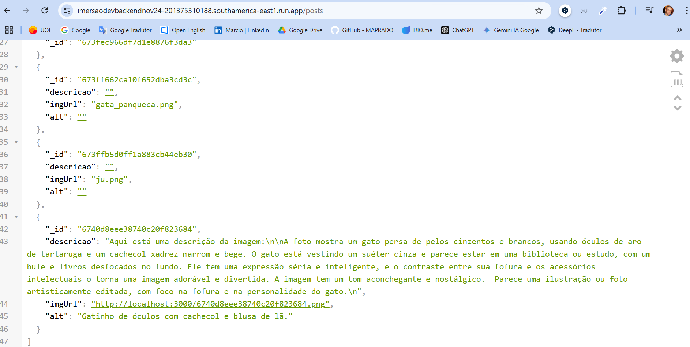
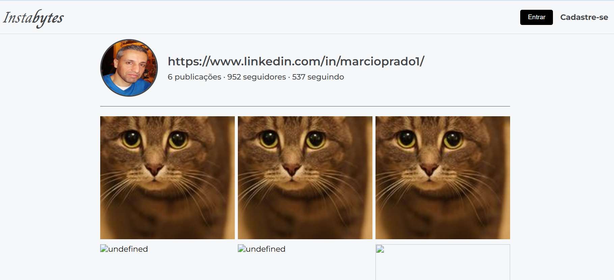

# Imersão DEV Back-End Alura

Durante a Imersão Dev Back-end, mergulhamos no mundo das APIs e configuraramos nosso primeiro servidor local com Node.js. Tudo isso com a ajuda do Gemini a Inteligência Artificial do Google.

Construimos o backend de um clone do Instagram, com servidor em node.js, API para interação com banco de dados em MongoDB e integração com serviços externos(API Google AI Studio).

## O que é Node.js?

Node.js é uma plataforma muito popular para desenvolvimento back-end por sua eficiência e versatilidade. Com ele, vamos pode criar APIs, servidores e gerenciar grandes volumes de requisições de forma escalável.

É amplamente utilizado por empresas e desenvolvedores para construir aplicações robustas e rápidas.

## Link para API do Projeto

> Link final para a API backend no Google Cloud Platform: [API do serviço](https://imersaodevbackendnov24-201375310188.southamerica-east1.run.app/posts).

## Back-end rodando no Google Cloud Platform

## Front-end local para teste da API

## Tecnologias utilizadas no projeto

> Além dos serviços Google Gemini, API Google AI Studio e da ferramenta Thunder Client.
>